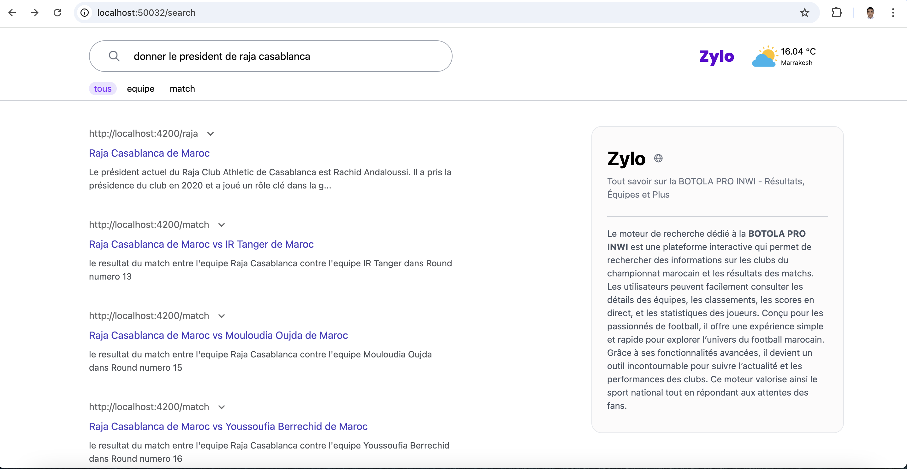

# 📚 **Moteur de Recherche pour la Botola Pro** ⚽



## 🗒️ **Description**

Ce projet vise à développer un moteur de recherche intelligent dédié à la **Botola Pro**, le championnat marocain de football. L'application permet aux utilisateurs d'effectuer des recherches en langage naturel pour obtenir des informations sur les équipes et les matchs. Grâce à **Elasticsearch**, des modèles de traitement de langage naturel et des technologies modernes, ce projet offre des performances optimales et une interface utilisateur fluide.

---

## 🎯 **Objectifs du Projet**

1. **Centraliser les Données**  
   - Rassembler les informations sur la **Botola Pro** à partir des fichiers CSV.

2. **Indexer les Données**  
   - Optimiser les recherches rapides et pertinentes avec Elasticsearch.

3. **Interface Utilisateur Intuitive**  
   - Fournir des informations essentielles, comme :  
     - 📅 Résultats des matchs  
     - 📊 Statistiques des équipes et des joueurs

4. **Exploitation d'Elasticsearch**  
   - Gérer efficacement les requêtes complexes en langage naturel.

5. **Utiliser Kibana pour Visualiser les Données**  
   - Permettre une exploration interactive des documents indexés.

---

## ⚛️ **Architecture et Technologies**  

### 🔹 **Backend**  

- **Python**  
  - Traitement des données, API Flask.

- **Elasticsearch / Sentence Transformers (`all-mpnet-base-v2`)**  
  - Indexation et recherche avec des embeddings optimisés pour la performance.

### 🔸 **Frontend**  

- **Angular**  
  - Interface utilisateur pour les requêtes et l'affichage des résultats.

### 📊 **Données**  

Les fichiers CSV incluent :  
- **`data_botola_inwi.csv`** : Informations sur les équipes.  
- **`resultats.csv`** : Résultats des matchs et statistiques.

---

## 📝 **Installation et Utilisation**  

### 📜 **Prérequis**  

Pour exécuter ce projet, assure-toi d'avoir :

- **Python (v3.8+)** : Flask, pandas, Elasticsearch.
- **Node.js (v16+)** : Pour Angular.
- **Elasticsearch (v8.x)**.
- **Kibana (v8.x)**.

---

## 📥 **Étapes d'Installation**

### 1. **Clone le Dépôt**  

```bash
git clone https://github.com/tarikprogrammer/SRI-Project.git
cd SRI-Project
```
### 2. **Configurer le Backend**  
```bash
cd python-indecationData
pip install -r requirements.txt
python flask-api.py
```
### 3. **Configurer Elasticsearch**  
- Installer et lancer Elasticsearch sur [https://localhost:9200](https://localhost:9200 "Accédez à Elasticsearch localement").
- Utiliser `indexMapping.py` pour configurer et indexer les données.

### 4. **Configuration Kibana**
- Installer et lancer Kibana sur [http://localhost:5601](http://localhost:5601 "Accédez à Kibana localement").
- Voir les documents indexés via kibana .

### 5. **Configurer le Frontend**
```bash
cd Zylo-SRI
npm install
ng serve --open
```
## 🔍 **Utilisation**

### 1. **Ouvrez l'application Angular sur :**
[http://localhost:4200](http://localhost:4200)
### 2. **Effectuez des requêtes en langage naturel**
> *"Qui est le président du Wydad Casablanca ?"*
## 🤝 **Contributeurs**

<div align="center">

<table>
  <tr>
    <td align="center" style="padding: 20px;">
      <a href="https://github.com/tarikprogrammer">
        
      </a>
      <br>
      <strong>👩‍💻 <a href="https://github.com/tarikprogrammer" style="text-decoration: none;">Tarik Belaid</a></strong>
    </td>
    <td align="center" style="padding: 20px;">
      <a href="https://github.com/naacer">
        
      </a>
      <br>
      <strong>🧑‍💻 <a href="https://github.com/naacer" style="text-decoration: none;">Nacer Abali</a></strong>
    </td>
    <td align="center" style="padding: 20px;">
      <a href="https://github.com/Ismailchaoufi">
        
      </a>
      <br>
      <strong>👨‍💻 <a href="https://github.com/Ismailchaoufi" style="text-decoration: none;">Ismail Chaoufi</a></strong>
    </td>
    <td align="center" style="padding: 20px;">
      <a href="https://github.com/A-E-Mourabet">
        
      </a>
      <br>
      <strong>👩‍💻 <a href="https://github.com/A-E-Mourabet" style="text-decoration: none;">Anass El Mourabet</a></strong>
    </td>
  </tr>
</table>

</div>